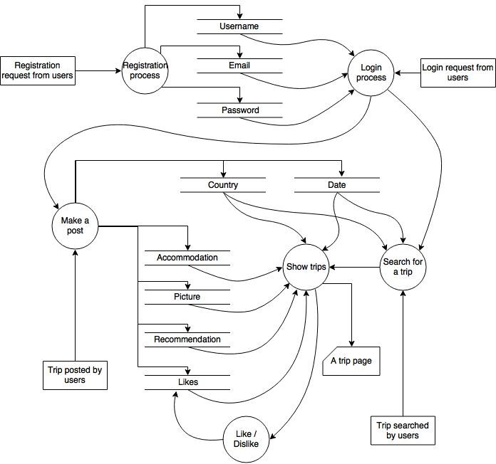
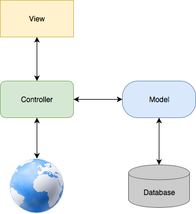
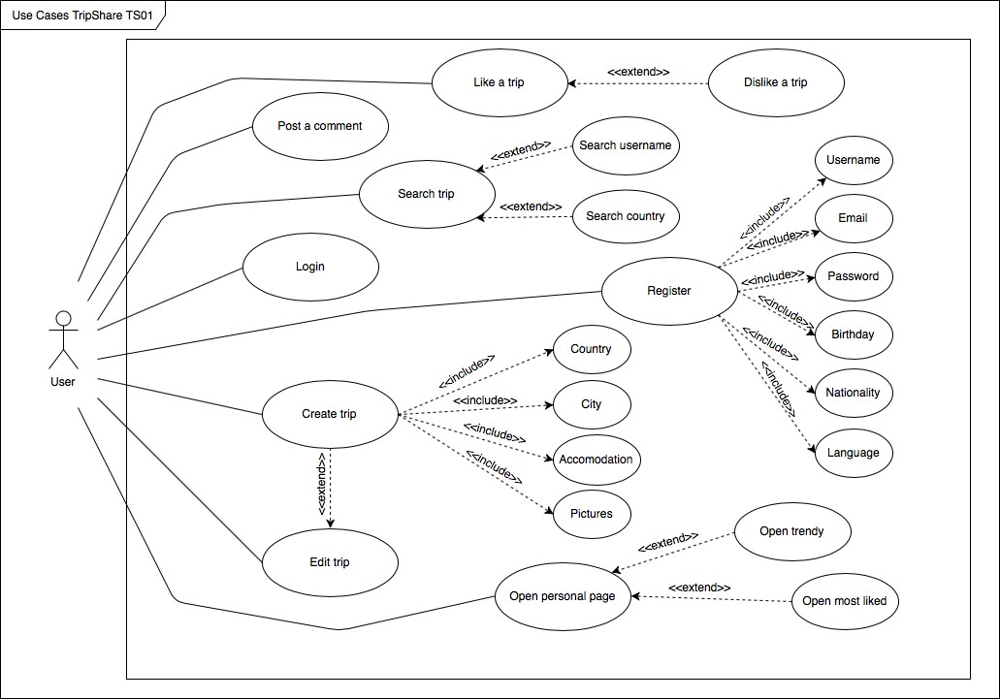
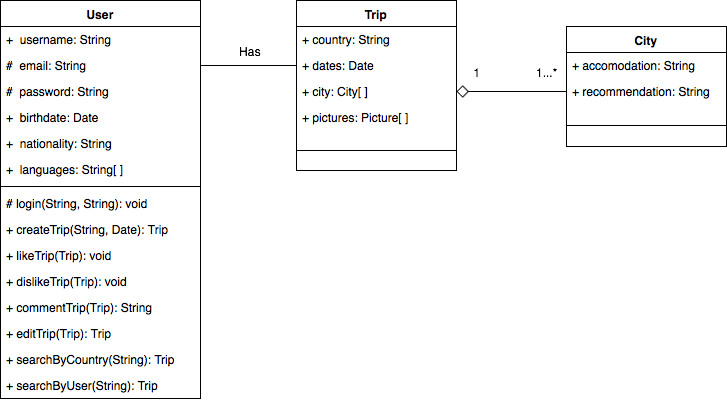
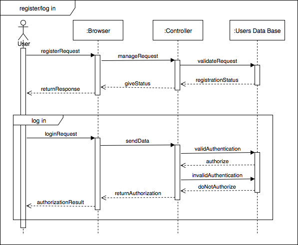
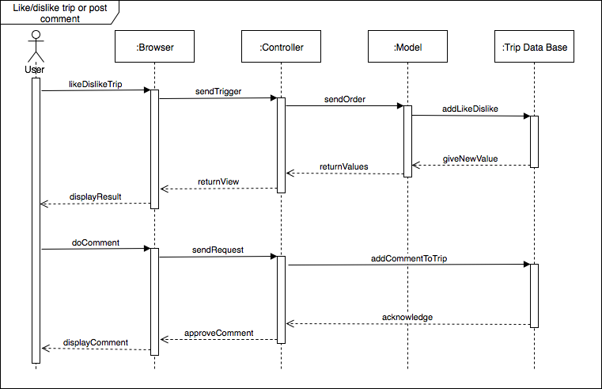
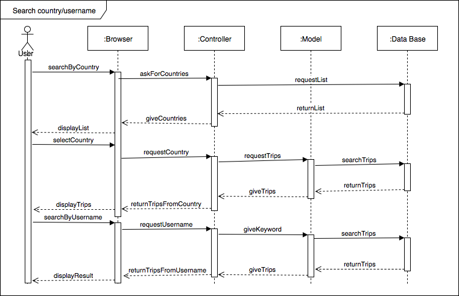
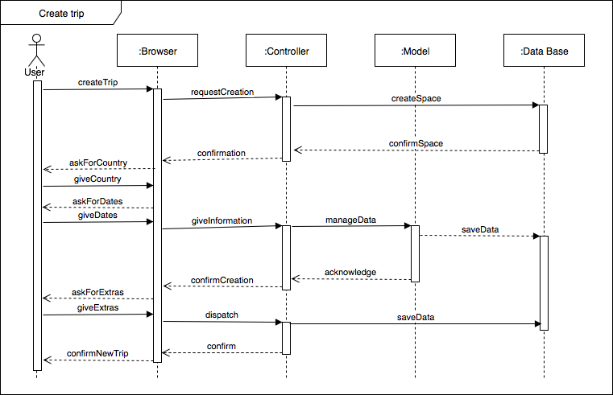
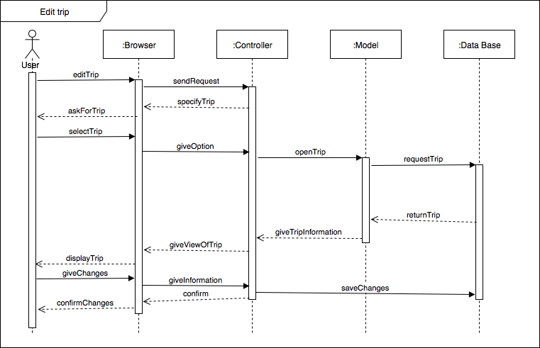
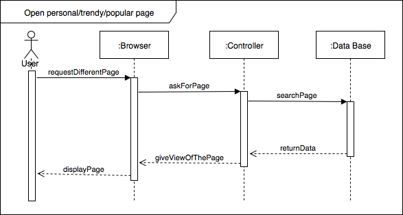

# TripShare by Group 38 from CSCI3100

## Introduction
1. Project Overview:
    With globalization, more and more people nowadays like to travel around the world to release the pressure during their short breaks or long vacations. Travelling becomes a common hobby for most of the people in the world, including all of our groupmates. Our project, namely “TripShare”, will develop an application related to travelling.

    “TripShare” offers an online web-based platform for those trip lovers to share their trips and to collect the information on the destination they are likely to go. “TripShare” aims at providing the users with an experience in writing a personal travelling blog. Therefore, the main feature of “TripShare” is to personalize your own trip and share it to everyone in the world.

    Sharing your own trip is the main feature of “TripShare”. In “TripShare”, users can simply post their pictures at the city they travelled with all kinds of experience, like the recommendation of their accommodation, their experience, and the type of travel. Their posts mainly focus on the personal experience and feeling instead of writing something unbiased.

    Another feature is to view the information on certain tourist posts. After sharing the experience, it is worth viewing others’ opinions for your next trip. To look for information on certain tourist spots, the users can directly search for them on this website. “TripShare” will show the users the travel posts from others who have travelled there. The experience and comments give other users with a better understanding of these places.

    Finally, when the users simply want to travel but have no idea on the destination, they can see the trend which is based on the ‘like’ they get from the users on the dashboard. They can plan a whole new trip without knowing any preparation in “TripShare”. 

    “TripShare” let every user in the world know that finding a trip is no longer a harsh task with the aid of “TripShare”.

2. Objective:
	“TripShare” is a platform that the users can mainly share their trips. Through the shared posts, other users can then plan a new trip easily. Experienced travellers can inspire  other users who are planning a trip through sharing their travelling blog. People who are planning a trip can find some resources by reading all the existed comments and post in the “TripShare”. In addition, the users can share their potential plan so that they can find a travelling partners through “TripShare”.

	The ultimate goal of “TripShare” is to make travelling easier. It helps the users know more about the places they are going to travel; thus, people can prepare for their trip more properly. “TripShare” is also a kind of record in the users’ life. They store every memory in their trips in “TripShare” and share them to others. When they stop their footsteps and look back to their own life, “TripShare” will be their footprint on our Earth.
	
    “TripShare” is actually a self-contained web application. All the resources come from the users. Like OpenRice in Hong Kong and TripAdvisor, the system only provides the users with the places they can travel. The rest of jobs will leave to the users. The difference in current application is that “TripShare” is a blog-based application. The users write a travelling blog and mark the places into the system. It will automatically share the corresponding parts to other users.

3. Expected Customers and Markets:
    Our target users is the general public. Everyone who is interested in travelling will be our target. Due to the blog-based property, all the users are both customer and provider. They will provide the information of particular destination through writing a post. Based on all the posts they write, other users can plan a new travel on it. After finishing the trips, they can then contribute back to the rating and commenting system through writing a travelling blog.

    In order to get the high domination in the public market, we have three stages for “TripShare”. At each stage, the focused customer will be a little bit different.

    In the very beginning, as the data are not rich enough, the target users will be some travelling bloggers. The marketing strategy and focusing will try to promote our blogging functions first in order to attract those bloggers to write the blogs. “TripShare” will mainly focus on the UX development of writing the travel blogs.

    After building a rich database, our focus will shift to those who want to search for the travelling information. They can then make use of the built data from previous stage to plan their own trips. At this stage, the market of “TripShare” will grow bigger than before. The focused users will no longer be the experienced travellers anymore. We have to change the marketing strategy here for general users. Besides, for the technical concern, the server loading and high availability will be the challenge at this stage.
	
    At the last stage, our focus will completely shift to the general public. At this stage, the whole application is self-contained. Every user can be both blogger and searcher. This is our ultimate market for “TripShare”.

4. System Features:
    “TripShare” focuses on the sharing functions in the travel experience and feeling. Therefore, the main system feature is the blogging function. The users can upload their own record of last trip after logging in to the system. Users can upload their own photos and comments on particular places, including cities and accommodation. This kind of blogging will match with the exact place in the world and become the comments in “TripShare”.

    The second system feature is the sharing information after writing the blogs in “TripShare”. When the users try to plan for their next trip, they can browse all the comments in the system. Those comments come from the blogs of other users. They can take them as a reference for their planning.

    The last system feature is the trip analysis for users. With the usage in “TripShare”, the system will log down some important information, like searching trends. The users of “TripShare” can then make use of these data to find their next destination. This system feature is built on top of the existing data in the system. It help boost the user experience (UX) of “TripShare”.


## Requirements Specification
### Functional Requirements
1. User registration
    To register, the user will need to give a username, an email, a password, and some optional information (birthday, nationality and languages). The password must be given twice for confirmation.
 
2. Log in of a user
    To login the user must insert a valid username and password.
 
3. Creating a new trip
    The user is able to create new trips specifying the country and the dates for general use.
 
    Then he/she needs to add a city specifying the accommodation (recommendations and and comments) and information of that city (good decisions, bad decisions, what to visit?).
    
    At the end, the user has the option to post some pictures of the trip by uploading them to the system.
 
4. Like and dislike trips
    Every public trip has a section of likes and dislikes. Meaning that all registered users can give their votes. The number of likes and dislikes will be shown beside the buttons.
 
5. Comment section
    Every trip has a comment section where registered users can give their opinions about that post. The comments are public for everyone, but only the users that logged in are able to post something.
 
6.  Page with most liked trips
    The most liked page shows the most popular places based on the number of likes. This section will only show the most recent trips (one month as maximum). This page is public.
 
7. Show personal page
    The personal page displays the user’s personal trips. It has all the trips from newest to oldest, with an option to modify them (only for the owner).
 
8. Edit trips
    Based on the personal page, every user has the opportunity to modify their old posts by clicking the button of edit.
 
9. Show trendy countries
    The trendy page shows the top 10 countries to travel and the most popular post of that country.
 
10. Search by country/username
    A public search bar can be used to search trips for a specific country or username. The bar will display all the countries available when searching countries or an input textbox when searching usernames.

### Non-functional Requirements
1. Design
    Use of material design, classic principles of design mixed with the use of science and technology. This allows us to play with the light, surface and movement creating interaction between objects and the user.
 
2. Usability
    In order to post a new trip or search something there should not be too many steps. The design will guide the user in every step making each process fast, reaching a page or opening a trip in less than 3 clicks after logging in.

### Future Implementations
1. Location of the places
    The exact location of a place will be shown on a map, making the experience more real and interactive.
 
2. Tag friends to the trips
    The user has the option to tag a friend to the trip by using his/her username. This will give a notification to the other user.

## Specification
### Data Flow Diagram

## System Architecture
### Architecture Diagram
The whole application is build by using the Ruby on Rails web framework. This framework is totally written in Ruby programming language and is based on Model-view-controller (MVC) architectural pattern, which means that it divides the software into three interconnected parts that interact with each other.

The whole process with Rails work like this: a browser sends a request, which is received by a webserver that passes everything to Rails controller. After that, there are two options, the first one is to immediately render a view and send it back to the browser in form HTML or, the second one and most common, the controller interacts with model, which is a Ruby object that communicates with the database, then it renders the view and returns the web page to the browser as HTML. (Hartl, 2018) The next diagram shows the whole process.

## Use Cases Diagram

| Code | TS01 |
|-------------|-----------------------------------------------------------------------------------------------------------------------------------------------------------------------------------------------------------------------------------------------------------------------------------------------------------------------------------------------------------------------|
| Name | Use Cases TripShare |
| Actors | User |
| Description | This web application let the users know more about a,travel experience as well as publish their own trips to share with the,community.,Every user can register, log in, create a trip, edit,an existing trip, search trips, search countries, search other users, like or,dislike a post, post a comment, and open the personal page, trendy page or,most liked page. |

## UML Class Diagram

## Sequence Diagrams
* To register new user and log in.

* To like or dislike a trip.

* To search a trip by country or username.

* To create a trip.

* To edit a trip.

* To open the personal, trendy, or popular page.

